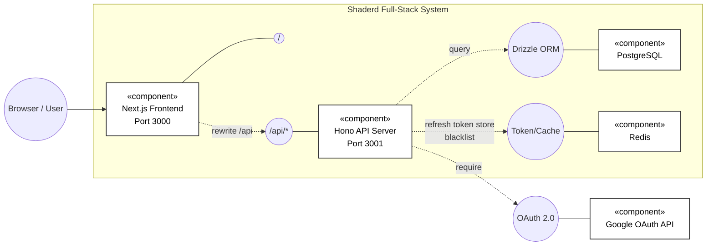

# System Architecture

## Overview

ระบบนี้เป็นสถาปัตยกรรมแบบ Full-Stack ที่แยกชั้นการทำงานชัดเจน (Frontend, Backend, Data Services) และ deploy ด้วย Docker Compose

- Frontend: Next.js (React)
- Backend: Hono (Node.js + TypeScript)
- Data Layer: Drizzle ORM + PostgreSQL
- Cache/Token Store: Redis
- External Service: Google OAuth

หมายเหตุ: จากโค้ดปัจจุบัน ระบบไม่ได้ใช้ NestJS, Prisma หรือ Vite runtime สำหรับ production

## High-Level Diagram

## Component Breakdown

### 1) Frontend (Next.js)

- Routing and Rendering
: ใช้ Next.js app structure และหน้า client-side สำหรับ flow หลัก เช่น login, account, admin

- API Access
: ใช้ openapi-fetch client และเรียก API ผ่าน base path `/api/*`

- API Rewrite
: ใน `next.config.ts` มี rewrite จาก frontend `/api/:path*` ไป backend ตาม `NEXT_PUBLIC_API_URL`

- Auth State
: ใช้ Zustand persist store เก็บ `accessToken`, `refreshToken`, และข้อมูล user

- Token Refresh
: มี middleware ฝั่ง client ที่ดัก `401` แล้วเรียก `/api/auth/refresh` อัตโนมัติ พร้อม retry request

### 2) Backend (Hono)

- Runtime
: ใช้ Hono + `@hono/node-server` ให้บริการ REST API บนพอร์ต 3001

- Route Modules
: แยกโมดูลเชิงโดเมน เช่น `auth`, `account`, `posts`, `users`, `roles`, `logs`

- Auth & Authorization
: ใช้ JWT Bearer Token + refresh token และ middleware ตรวจสิทธิ์ (`authMiddleware`, `authAdminMiddleware`)

- Security Controls
: มี login lockout ผ่าน Redis, token blacklist ตอน logout, และ role/status checks ใน endpoint

- API Docs
: มี OpenAPI endpoint (`/doc`) และ Scalar UI (`/scalar`) พร้อม basic auth

### 3) Database Layer (Drizzle + PostgreSQL)

- ORM
: ใช้ Drizzle ORM สำหรับ schema และ query

- Core Entities
: `users`, `posts`, `post_likes`, `post_dislikes`

- Operational/Security Logs
: `server_logs`, `user_interactions`

### 4) Redis Layer

- ใช้เก็บ refresh token mapping ตาม `jti`
- ใช้ blacklist access token หลัง logout
- ใช้เก็บ counter สำหรับ login failed attempts และ lock key

### 5) External Integration

- Google OAuth
: ใช้สำหรับ social login โดย backend จัดการ callback และออก JWT ของระบบเอง

## Runtime / Deployment Architecture (Docker Compose)

จาก `compose.yaml` ระบบประกอบด้วย 4 services หลัก

1. `postgres`
: บริการฐานข้อมูลถาวร พร้อม healthcheck

2. `redis`
: บริการ in-memory store สำหรับ auth/session control

3. `backend`
: build จาก `fullstack-project-back`, bind พอร์ต `3001:3001`, mount `uploads` และ `logs`

4. `frontend`
: build จาก `fullstack-project-front`, bind พอร์ต `3000:3000`

จุดสำคัญ: ปัจจุบันไม่มี reverse proxy service แยกใน compose (เช่น Pangolin/Nginx) โดย frontend เชื่อม backend ผ่าน rewrite และ environment configuration

## Data & Request Flow (Typical)

1. ผู้ใช้เข้าใช้งานผ่าน browser ที่ frontend
2. frontend เรียก API ผ่าน `/api/*` (rewrite ไป backend)
3. backend ตรวจ JWT/role/status ตาม endpoint
4. backend อ่านเขียน PostgreSQL ผ่าน Drizzle
5. backend ใช้ Redis สำหรับ refresh token, blacklist และ lockout logic
6. frontend รับผลลัพธ์และอัปเดต state ผ่าน Zustand

## Architectural Characteristics

- Modular monolith (backend แยกเป็น route modules แต่ deploy เป็น service เดียว)
- Clear separation of concerns ระหว่าง UI/API/Data
- Containerized deployment ทำซ้ำได้
- รองรับการขยายต่อในอนาคต เช่นแยกบริการ auth หรือเพิ่ม edge proxy โดยไม่ต้องรื้อแกนหลักทั้งหมด

